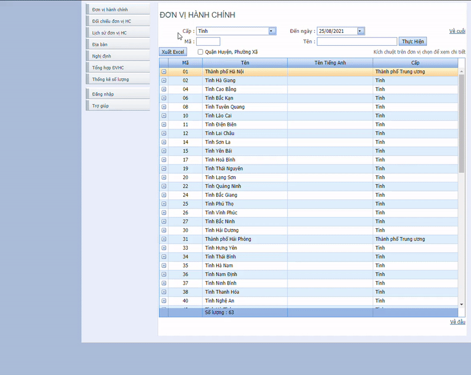
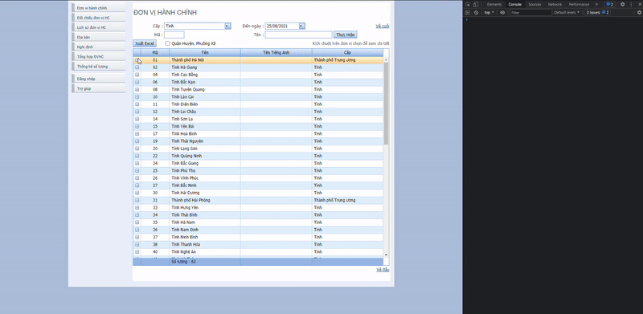
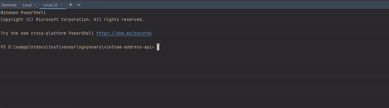

# Đơn Vị Hành Chính Việt Nam
> Một thư viện được viết bằng PHP để lấy thông tin các đơn vị hành chính Việt Nam (Tỉnh, Thành Phố, Quận, Huyện, Xã, Phường, Thị Trấn...)
## Installation
Install vào dự án bằng `composer`
```properties
composer require nguyenary/vietnam-address-api
```
## Usage
<br>

### **1. Cách Tự Update Data Đơn Vị Hành Chính Việt Nam (*nếu có thay đổi*)**
<br>

Nếu trong tương lai dữ liệu ***Đơn Vị Hành Chính Việt Nam*** có thay đổi thông tin (Quận, Huyện, Xã, Phường..v..v) bạn có thể chủ động update lại dữ liệu bằng cách dưới đây.

Dữ liệu được xuất từ các file `excel` tải từ địa chỉ: [https://danhmuchanhchinh.gso.gov.vn/](https://danhmuchanhchinh.gso.gov.vn)

**Cách để tải file `excel` từ địa chỉ trên:**



**Cách để tải file `excel` tất cả các địa danh bằng `script`:**

Hãy copy code trong file `download-script.js` truy cập vào địa chỉ trên. Nhấn `Ctrl + Shift + I` để mở `console` và paste đoạn code vào đây và kết quả sẽ như hình phía dưới.



File `excel` được lưu trong folder `excel_files`

Để update dữ liệu mới cho Đơn Vị Hành Chính hãy bỏ file `excel` đã tải vào folder này và tiến hành chạy lệnh:
```properties
cd vendor/nguyenary/vietnam-address-api
php export.php
```
Sẽ được kết quả như sau:



Vậy là bạn đã tự update lại dữ liệu Đơn Vị Hành Chính thành công!
<br><br>
>Hoặc bạn có thể tạo `issues` trong project để báo cáo vấn đề về dữ liệu đang gặp phải hoặc chủ động tạo `pull requests` để đóng góp bản cập nhật dữ liệu mới cho project này.

<br>

### **2. Cách Sử Dụng Trong Dự Án**
<br>

```php
require 'vendor/autoload.php';

use NguyenAry\VietnamAddressAPI\Address;
```

Xem ví dụ cụ thể tham khảo file `example.php`

#### ***`Address::getProvinces()`***
> Lấy tất cả Tỉnh / Thành Phố của Việt Nam
- Option: 
    - province_ids (array) : Mảng chứa danh sách province_id muốn lấy
#### ***`Address::getProvince()`***
> Lấy thông tin của một Tỉnh, Thành Phố theo `province_id`
- Require:
    - province_id (string) : province_id của Tỉnh / Thành Phố muốn lấy thông tin
#### ***`Address::getDistrictsByProvinceId()`***
> Lấy danh sách Quận / Huyện của một Tỉnh / Thành Phố bằng `province_id`
- Require:
    - province_id (string) : province_id của Tỉnh / Thành Phố để lấy danh sách các Quận / Huyện của nó
#### ***`Address::getDistrict()`***
> Lấy thông tin của Quận / Huyện bằng `district_id`
- Require:
    - district_id (string) : district_id của Quận / Huyện cần lấy thông tin
#### ***`Address::getWardsByDistrictId()`***
> Lấy danh sách Xã / Phường / Thị Trấn của một Quận / Huyện bằng `district_id`
- Require:
    - district_id (string) : district_id của Quận / Huyện để lấy danh sách Xã / Phường / Thị Trấn của nó
#### ***`Address::getWard()`***
> Lấy thông tin Xã / Phường / Thị Trấn bằng `distric_id` và `ward_id`
- Require:
    - district_id (string) : district_id của Quận / Huyện chứa Xã / Phường / Thị Trấn cần lấy thông tin
    - ward_id (string) : ward_id của Xã / Phường / Thị Trấn cần lấy thông tin
#### ***`Address::setSchema()`***
> Định dạng lại các trường sẽ trả về. Gọi hàm này trước khi gọi các phương thức `get` ở trên (Mặc định sẽ trả về tất cả)
- Option:
    - schema (array) : Mảng chứa danh sách các trường cần lấy (Vd: name, type, code,...v..v)
#### Project này có tái sử dụng code từ: [madnh/hanhchinhvn](https://github.com/madnh/hanhchinhvn)
